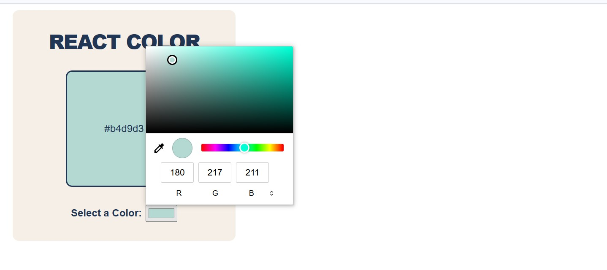

# React Color Picker Project

A color picker application built with React.js that utilizes the `useState` hook to manage state values.

## Description

The application includes:

- An input field of type "color" that allows users to pick any color from a color palette.
- A display box that dynamically updates to show the selected color.
- The color code of the selected color displayed alongside the color box.

## Screenshots

